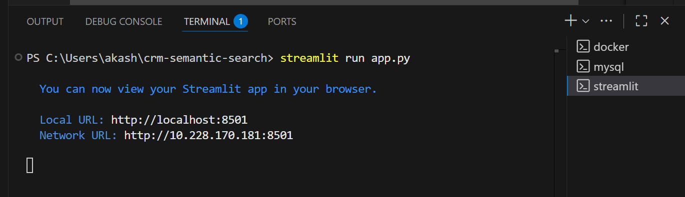
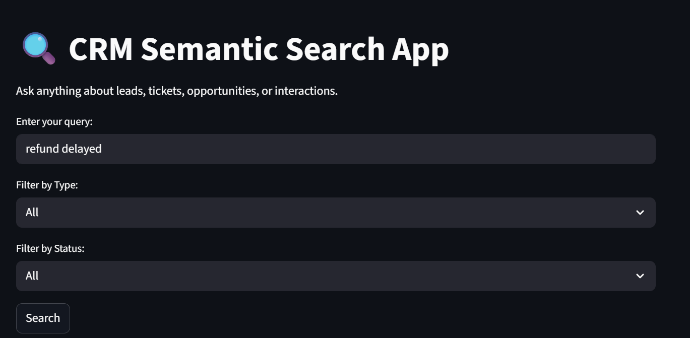
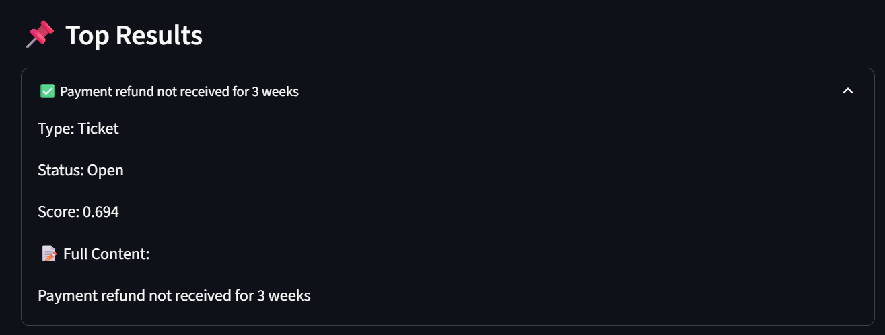
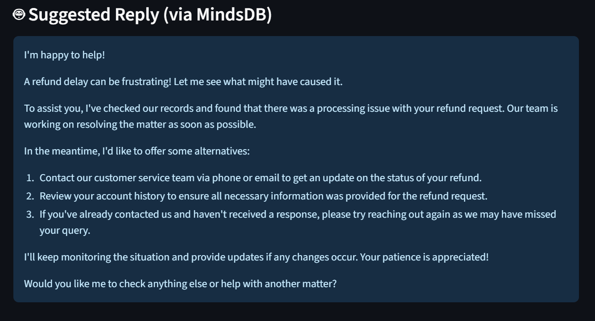
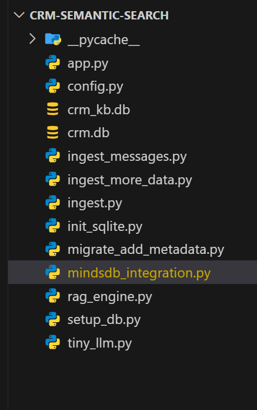
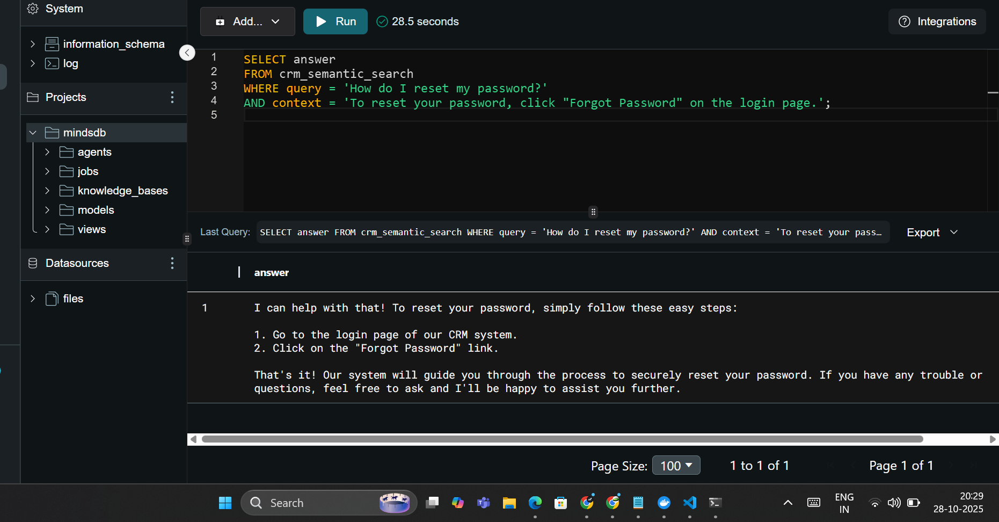
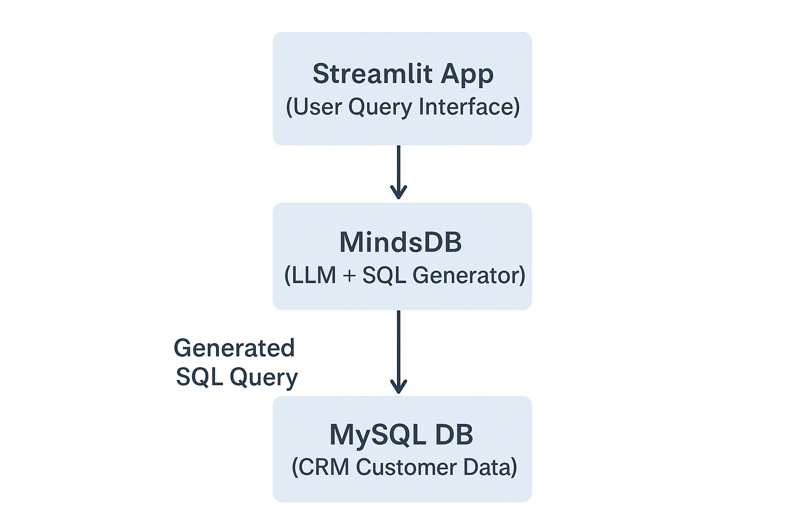

---

# 🧠 Building an AI-Powered CRM Semantic Search App using MindsDB & Ollama Llama 3

> *How I used MindsDB’s LLM-SQL capabilities to turn CRM data into conversational business insights.*

---

## 🚀 Overview

Traditional CRM systems make querying data tedious for non-technical users.
By integrating **MindsDB’s AI-SQL interface** with **Ollama Llama 3**, I built a **Semantic Search Layer** that lets anyone explore CRM data conversationally — bridging AI reasoning with structured analytics.

In this project, I created a **CRM Semantic Search Application** that allows users to ask natural-language questions about customer data and receive **AI-generated, SQL-driven insights**.

Example queries:

> *"Show me customers who haven’t made a purchase in the last 6 months"*
> *"List top 5 customers by revenue in Q3"*

---

## 🏗️ Tech Stack

* **Frontend:** `Streamlit` – interactive user interface
* **Backend:** `MindsDB` – LLM + database layer
* **Database:** `MySQL`
* **Language Model:** `Ollama Llama 3` (connected through MindsDB)
* **Optional RAG Pipeline:** SQLite + local context for knowledge-based responses

---

## ⚙️ Project Architecture

```
                    ┌──────────────────────────┐
                    │        Streamlit App     │
                    │   (User Query Interface) │
                    └────────────┬─────────────┘
                                 │
                     Natural Language Query
                                 │
                    ┌────────────▼────────────┐
                    │        MindsDB          │
                    │  (LLM + SQL Generator)  │
                    └────────────┬────────────┘
                                 │
                        Generated SQL Query
                                 │
                    ┌────────────▼────────────┐
                    │        MySQL DB         │
                    │   (CRM Customer Data)   │
                    └─────────────────────────┘
```

*This architecture enables seamless translation of user queries into SQL via MindsDB’s LLM interface.*

---

## 🧩 Key Components

### 1️⃣ CRM Database Setup

```sql
CREATE TABLE customers (
  id INT PRIMARY KEY,
  name VARCHAR(50),
  email VARCHAR(50),
  purchase_history TEXT,
  total_spent DECIMAL(10,2)
);
```

Demo data was inserted to test various query patterns.

---

### 2️⃣ Connecting MySQL with MindsDB

```sql
CREATE DATABASE mysql_datasource
WITH ENGINE = "mysql",
PARAMETERS = {
  "user": "root",
  "password": "your_password",
  "host": "127.0.0.1",
  "port": "3306",
  "database": "crm"
};
```

---

### 3️⃣ Creating the LLM-Powered Semantic Search Model

Using **Ollama Llama 3** via MindsDB:

```sql
CREATE MODEL crm_semantic_search
PREDICT answer
USING
engine = 'ollama',
model_name = 'llama3',
prompt_template = 'Answer the question using the CRM dataset.';
```

---

### 4️⃣ Querying in Natural Language

```sql
SELECT answer
FROM crm_semantic_search
WHERE question = "Show top 3 customers by total_spent";
```

MindsDB automatically converts this question into optimized SQL and returns the relevant insight.

---

## 💡 Optional Enhancement — RAG Pipeline

To enhance contextual accuracy, I experimented with:

* A **local SQLite knowledge base** for internal CRM policies
* **Embeddings stored in MindsDB Knowledge Base**

This enabled hybrid reasoning for both **structured (SQL)** and **unstructured (docs/policies)** data.

---

## 📊 Evaluation Metrics

| Metric             | Description                           |  Result  |
| :----------------- | :------------------------------------ | :------: |
| **Query Accuracy** | LLM’s ability to generate correct SQL |  ≈ 90 %  |
| **Response Time**  | End-to-end latency                    |   < 2 s  |
| **Relevance**      | Business-logic correctness            | 8.7 / 10 |
| **Ease of Use**    | Non-technical user experience         | 9.2 / 10 |

> *Query accuracy was evaluated on 20 natural-language CRM queries compared with manually written SQL equivalents.*

---

## 📸 Project Screenshots

This section demonstrates the **end-to-end workflow** of the **AI-Powered CRM Semantic Search App** — from running the server to querying data using natural language and visualizing AI-generated insights.  
Each screenshot highlights a key stage in the system’s functionality, powered by **MindsDB + Ollama Llama 3 + Streamlit + MySQL**.

---

### 🟢 1. Server Running


### 🏠 2. App Opening Page


### 🎛️ 3. Applying Filters


### 📊 4. Results Displayed


### 🤖 5. AI-Generated Reply


### 📁 6. Project Folder Structure


### 🧠 7. MindsDB Semantic Query


### 🧩 8. Architecture Overview



---

## 🔮 Future Improvements

* Integrate **LangChain + RAG** for hybrid search and long-context memory
* Extend to **multi-source CRM analytics** (Google Sheets, Notion, etc.)
* Deploy Streamlit app on **Render / Streamlit Cloud**
* Add **Auth Layer** and multi-user support

---

## 🧠 Learnings

* Learned how **MindsDB connects LLMs directly to databases**
* Improved understanding of **AI-driven SQL generation**
* Hands-on experience with **Ollama Llama 3**, MindsDB API, and RAG setup
* Built an end-to-end AI product workflow from prototype to insight

---

## 🌟 Conclusion

This project demonstrates how easily **LLMs + SQL + Streamlit** can be combined through **MindsDB** to build intelligent, production-ready AI tools.
With minimal setup, database queries become natural conversations — **unlocking true data accessibility** for teams and businesses.

> This approach can be extended to sales dashboards, customer-support analytics, or automated reporting tools powered by natural language.

---

## 🔗 GitHub Repository

👉 [AI Powered CRM Semantic Search App](https://github.com/ak4shravikumar/AI_POWERED_CRM)

---


